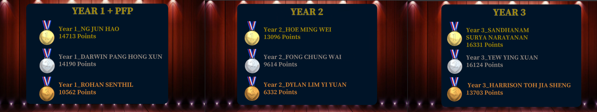

# NYP InfoSec CTF May 2022
Writeups for the challenges I solved during NYP InfoSec CTF held on May 2022.

## Categories
* [Camp CyberCure](./Categories/Camp_CyberCure)   
* [Programming](./Categories/Programming)   
* [Web](./Categories/Web)   
* [Reverse](./Categories/Reverse)   
* [Pwn](./Categories/Pwn)   
* [OSINT](./Categories/OSINT)   
* [Miscellaneous](./Categories/Miscellaneous)   
* [Forensics](./Categories/Forensics)   
* [Cryptography](./Categories/Cryptography)   
* [Networking](./Categories/Networking)   
 
## Results

* Placed 3rd in the Year 1 + PFP Category
