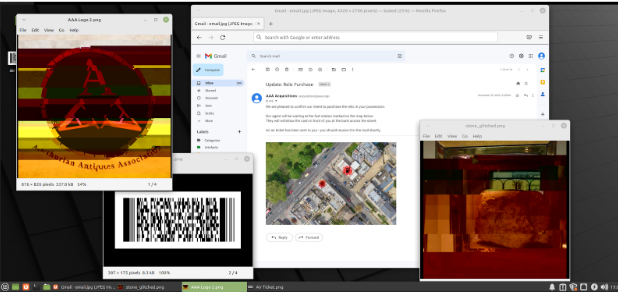

# Relic Race [409 Points]
*Solved By w0ng*

The Arthurian Artefact Association (AAA) is always on the lookout for interesting items of medieval history. Recently, a well-known art thief stole several important artefacts, and is in the process of arranging their sale to the association. Our field agents raided his hideout, but they arrived minutes too late. All that remained of the elusive thief was his laptop, with several applications still open.

If you can determine where our art thief plans to deliver the artefact to the AAA, our local agents may have a chance of intercepting them. Hurry - time is of the essence.

Flag: The postal code of the meeting location, wrapped in the flag format - E.g. STANDCON{E9 7ZZ}.

Note: Any resemblance to real places or people is entirely coincidental. This challenge does not involve making contact with anyone.

## Solution

The challenge talked about a meetup that is going to take place at a fuel station with a bank located across the street from it with a flight booked for us to get there.        



Using a barcode scanner, the plane ticket gave us some details about the flight. 


Analysing the flight ticket, we can deduce that the flight is set to depart from Singapore (SIN) and arrive at London Heathrow Airport (LHRBN). 
This tells us that the country of the meetup is in London

With the info we’ve gathered, we can deduce that the meetup is taking place at a fuel station in London that has a bank located across the street from it. 

To manually scan through London for the location in google maps will be a nightmare, luckily for us, the challenge hinted to use overpass turbo; a web based data mining tool and we’ll do just that.

To use overpass turbo, it will require a search query in order to pinpoint a location of interest.
Based on my deduction earlier, I wrote a query that searches for a fuel station in London that has a bank located at least 50 metres away from it:
node["amenity"="fuel"]["addr:city"="London"];
node["amenity"="bank"](around:50);
out;

Overpass turbo came through and gave us a fuel station on Wilberforce Road that is across HSBC Bank:


In order to find the postal code of the fuel station, we’ll have to dive deeper using google maps. 


We find ourselves outside a BP petrol station. 

```
Flag: STANDCON{N4 2AW}
```
